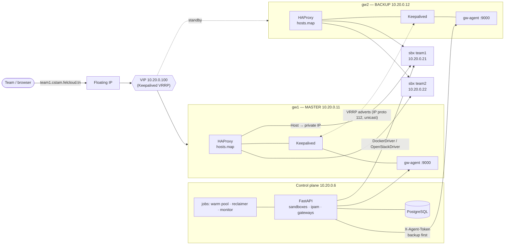
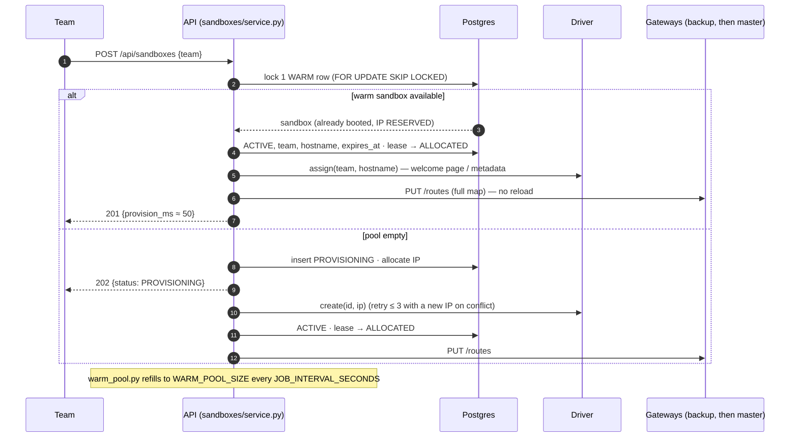
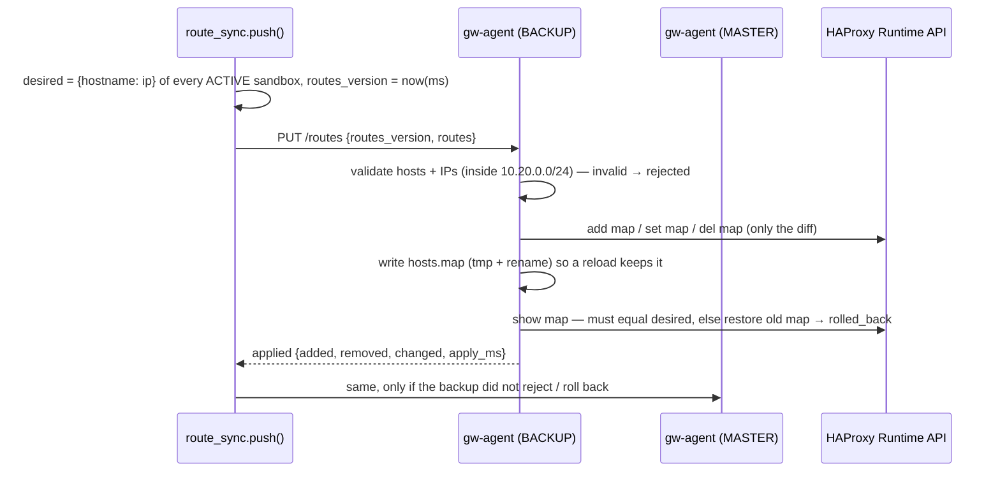
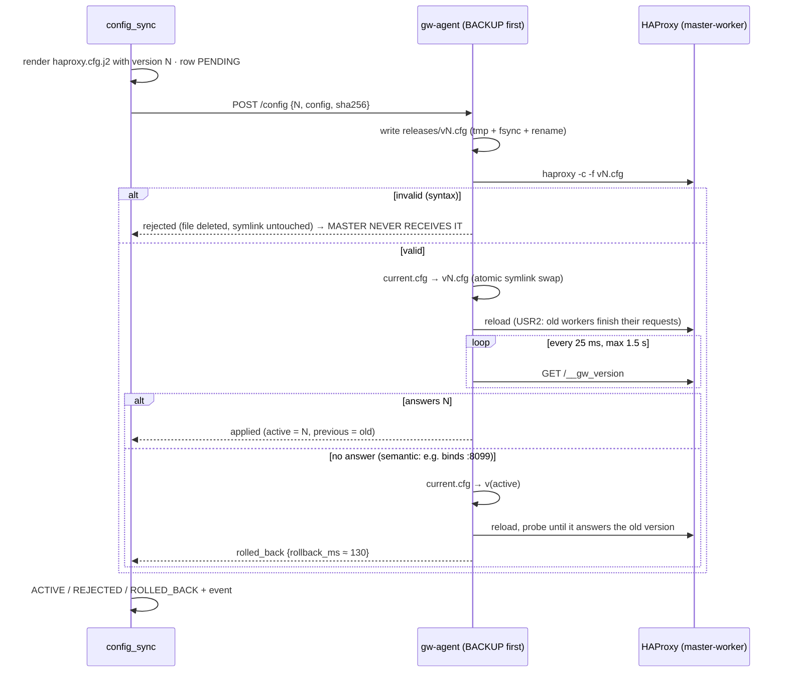
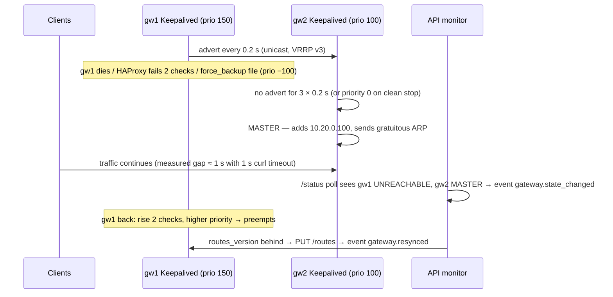
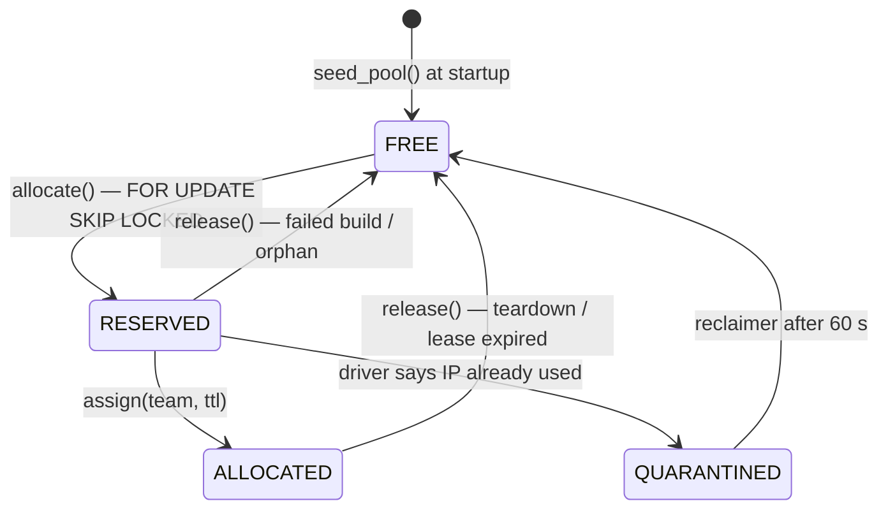

<!--
How CSTAM works, as diagrams: components, provisioning, route update, config release, failover, IPAM.
Responsible for: the "why" and the flow between parts. NOT responsible for: endpoint details (docs/api.md)
or deployment steps (infra/openstack/README.md). Serves all criteria.
-->
# CSTAM architecture

One **cell** = a private network 10.20.0.0/24, two gateways sharing a VIP, sandboxes, and a control plane.
Locally every box below is a Docker container; on OpenStack every box is a VM.

## Components

| Part | Code | Job |
|---|---|---|
| FastAPI | `api/app/` | the only brain: decides what exists, stores it in Postgres, tells drivers and gateways |
| Drivers | `api/app/drivers/` | create/delete a sandbox with a given IP (Docker container or Nova VM) |
| gw-agent | `agent/src/` | applies routes and configs on ONE gateway, safely, and reports its VRRP state |
| HAProxy | `api/app/gateways/haproxy.cfg.j2` | routes by Host header through `hosts.map` |
| Keepalived | `gateway/keepalived/` | moves the VIP to the healthy gateway |

## Provisioning — warm path (201) and cold path (202)

## Route update — no reload (Criterion 4a)

## Config release with automatic rollback (Criterion 4b)

## Failover (Criterion 2)

## IPAM lease states (Criterion 3)

Allocation order is `released_at NULLS FIRST, ip_int`: never-used IPs first, then the one released the
longest time ago — a just-freed IP is not handed out again immediately (stale ARP/DNS caches).

Reclaimer (every 5 s, `ipam/reclaimer.py`): expired ACTIVE → teardown (`lease_expired`); PROVISIONING
> 10 min → FAILED; QUARANTINED > 60 s → FREE; leases of DELETED/FAILED sandboxes → FREE
(`ipam.orphan_fixed`); containers/VMs with no live row → deleted (`driver.orphan_removed`).

## Design choices worth knowing

- **Map + `set-dst` instead of one backend per team.** `server sandbox 0.0.0.0:80` means "connect to
  the destination chosen by `set-dst`", i.e. the IP looked up in `hosts.map`. Adding a team is a map
  entry, so no reload is ever needed for routes. Checked on HAProxy 2.6 (Debian 12), the fallback in
  the spec (one backend per team) was not needed.
- **Backup first.** A bad change is caught by the gateway that is *not* serving traffic.
- **Full map, versioned.** The API always sends the whole map; agents diff. A restarted agent reports
  `routes_version 0`, the monitor sees it is behind and re-sends.
- **Agent never trusts input.** Routes must point inside `ALLOWED_CIDR`; configs must match their sha256.

## OpenStack gotchas

1. **allowed-address-pairs** on both gateway ports for 10.20.0.100, or Neutron drops VIP traffic.
2. **IP protocol 112** allowed between gateways, or VRRP adverts are dropped → split brain.
3. Neutron's subnet allocation pool is 10.20.0.200–250 so it never hands out an IP our IPAM owns.
4. Ubuntu 22.04's HAProxy is 2.4 → the gateway cloud-init adds the 2.8 PPA.

Details: [infra/openstack/README.md](../infra/openstack/README.md).
